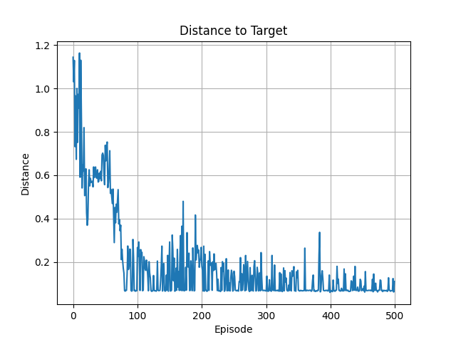
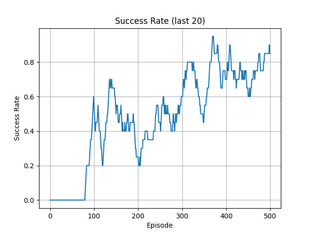
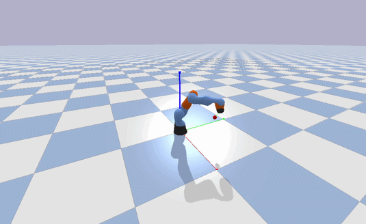

# Deep Reinforcement Learning for Robotic Reaching using SAC

This project implements a **robotic reaching task** using **Soft Actor-Critic (SAC)** in a PyBullet simulation.  
A 7-DOF KUKA iiwa manipulator learns to reach dynamically sampled 3D targets using **deep reinforcement learning**.

---

## 🚀 Overview

- Environment: PyBullet physics simulation  
- Robot: KUKA iiwa (7-DOF manipulator)  
- Task: End-effector reaching a 3D target  
- Algorithm: Soft Actor-Critic (SAC)  
- Learning Type: Off-policy deep reinforcement learning  

The agent learns a continuous control policy that maps robot joint states to actions, minimizing the distance to a target position.

---

## 🧠 Soft Actor-Critic (SAC)

Soft Actor-Critic (SAC) is an off-policy deep reinforcement learning algorithm designed for continuous control problems. It extends traditional actor-critic methods by introducing an **entropy maximization objective**, which improves exploration and stability.

Instead of learning a deterministic policy, SAC learns a **stochastic policy**, making it more robust in complex environments like robotics.

The SAC objective is:

$$
\pi^* = \arg\max_\pi \sum_t \mathbb{E}_{(s_t,a_t) \sim \pi} \left[ r(s_t, a_t) + \alpha \mathcal{H}(\pi(\cdot|s_t)) \right]
$$

Where:
- $r(s_t, a_t)$ is the reward
- $\mathcal{H}(\pi(\cdot|s_t))$ is the entropy of the policy
- $\alpha$ controls exploration vs exploitation

The Q-function follows the soft Bellman equation:

$$
Q(s,a) = r(s,a) + \gamma \mathbb{E}_{s'} \left[ V(s') \right]
$$

with:

$$
V(s') = \mathbb{E}_{a' \sim \pi} \left[ Q(s', a') - \alpha \log \pi(a'|s') \right]
$$

To reduce overestimation bias, SAC uses **twin Q-networks**:

$$
Q_{target} = \min(Q_1, Q_2)
$$

---

## ⚙️ Environment Design

### State Space (20D)
- Joint angles (7)
- Joint velocities (7)
- End-effector position (3)
- Target position (3)

### Action Space (7D)
- Continuous joint position deltas

### Reward Function
- Negative distance to target
- Bonus rewards for proximity thresholds:
  - < 0.2 → small reward
  - < 0.1 → medium reward
  - < 0.05 → success reward

---

## 📈 Training Setup

| Parameter        | Value        |
|----------------|-------------|
| Episodes        | 500         |
| Max Steps/Ep    | 200         |
| Batch Size      | 256         |
| Start Steps     | 2000        |
| Gamma (γ)       | 0.99        |
| Tau (τ)         | 0.005       |
| Optimizer       | Adam        |

- Replay buffer used for off-policy learning
- Automatic entropy tuning
- Curriculum learning via difficulty scaling

---

## 📊 Results

### Distance to Target


### Success Rate


### Observations
- Initial exploration phase with high variance
- Convergence to stable reaching behavior
- ~80% success rate achieved after ~500 episodes
- Performance drops temporarily when difficulty increases (expected behavior)

---

## 🎥 Simulation

## Demo



[Full Video](results/Simulation_C.mp4)

---

## 📁 Project Structure

---

## 🛠️ Installation

```bash
git clone https://github.com/Abhi-creator1/deep-rl-sac.git
cd deep-rl-sac

python -m venv venv
venv\Scripts\activate  # Windows

pip install -r requirements.txt
````

---

## ▶️ Run Training

```bash
python -m training.train
```

---

## 🔍 Key Features

* Deep reinforcement learning with SAC
* Continuous control for robotic manipulation
* PyBullet physics simulation
* Curriculum learning (difficulty scaling)
* Logging and visualization support
* Stable convergence with stochastic policy

---

## 📌 Future Work

* Domain randomization for sim-to-real transfer
* HER (Hindsight Experience Replay)
* Multi-target generalization

---

## 📄 License

MIT License

---

## 👤 Author

Abhishek Thakur
